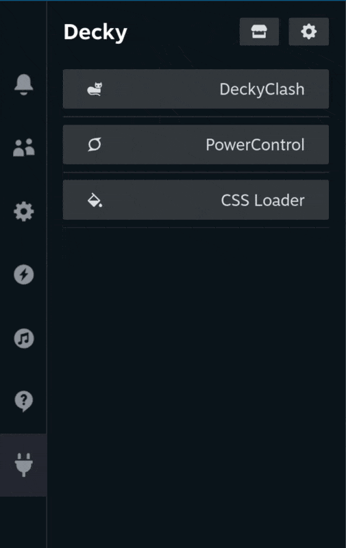
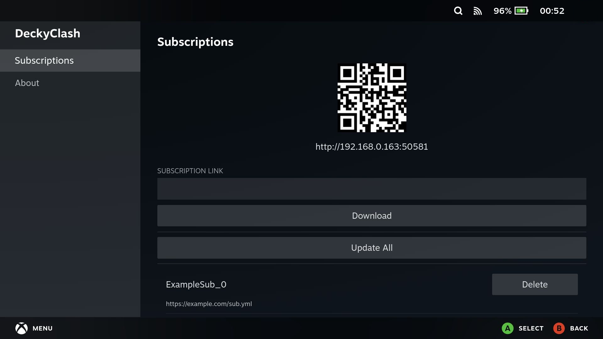
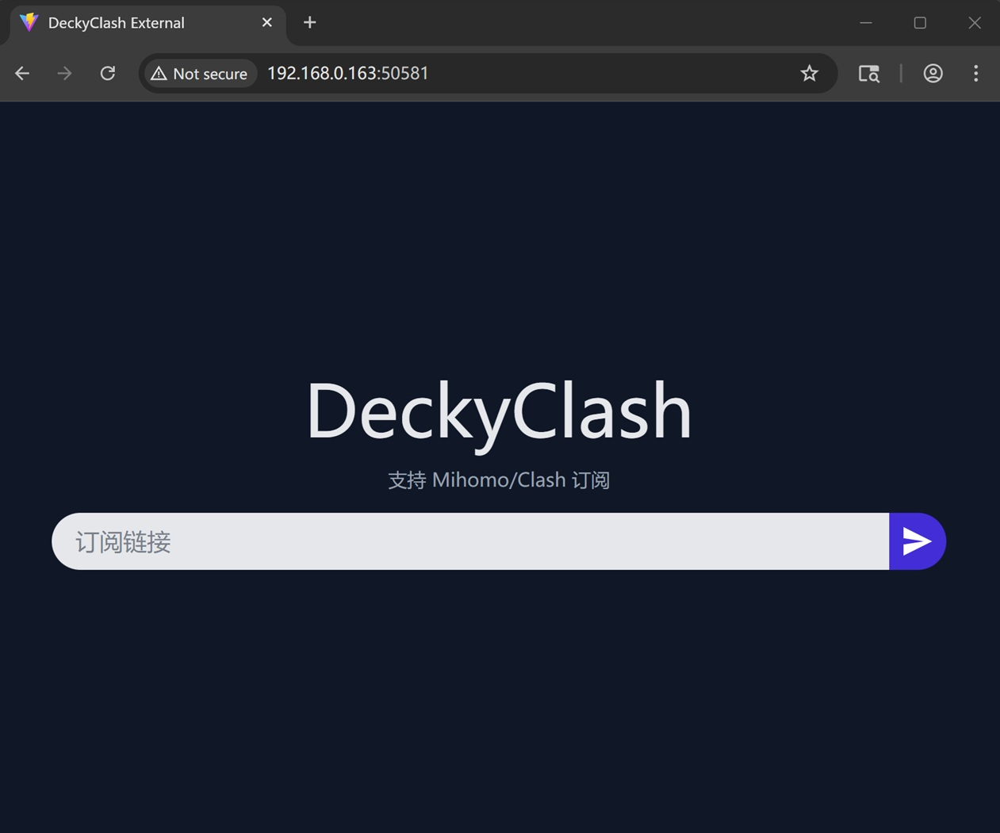
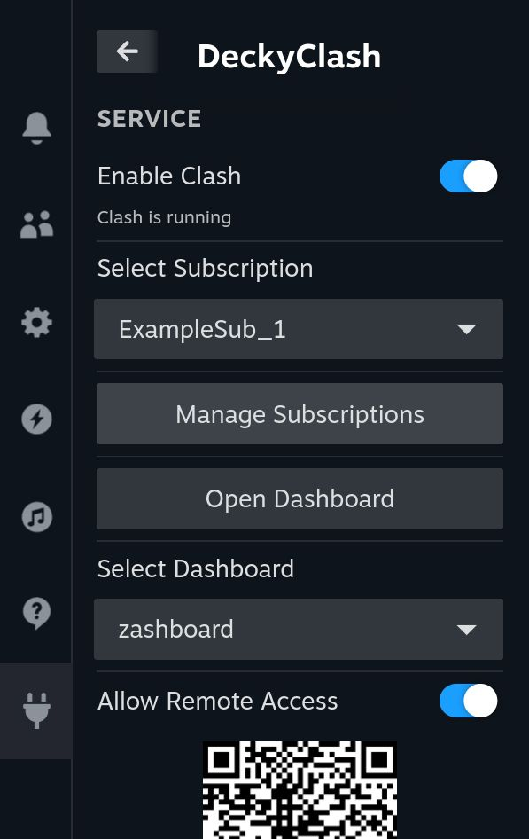
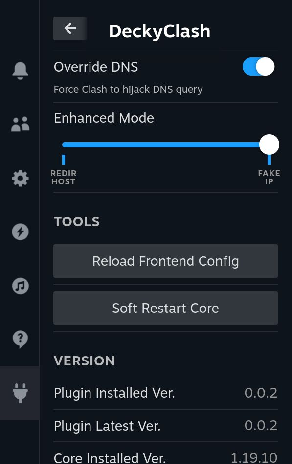

# DeckyClash

*Light-weight Clash/Mihomo proxy client for Steam OS*

*为 Steam OS 设计的轻量的 Clash/Mihomo 代理客户端*

**EN** | [中文](./README_CN.md)

## Screenshots

<div class="grid">
   
   
   
   
   
</div>

## Features

- ✅ **Full featured:** [Mihomo](https://github.com/MetaCubeX/mihomo) core included
- 🚀 **Blazing fast:** optimized frontend and backend
- 📦 **Easy to use:** out of the box, with subscriptions importer and QR code support, etc.
- 🔒 **Focus on security:** random controller password, controllable outside access, etc.
- ⚙️ **Friendly to maintain:** written by Python and Node.js (React & Vite)
- 🌍 **I18n ready:** currently with Chinese (Simplified) and English support

## License

This project is licensed by **BSD 3-Clause License** .

## Installation

1. Install [Decky Loader](https://github.com/SteamDeckHomebrew/decky-loader)

   ```sh
   curl -L https://github.com/SteamDeckHomebrew/decky-installer/releases/latest/download/install_release.sh | sh
   ```

2. Install DeckyClash

   ```sh
   curl -L https://github.com/chenx-dust/DeckyClash/raw/refs/heads/main/install.sh | bash
   ```

## Road Map

- [ ] Fix OTA upgrade
- [ ] Better documentation
- [ ] Upload to Decky Store

## Acknowledge

- [MetaCubeX/mihomo](https://github.com/MetaCubeX/mihomo): DeckyClash is powered by Mihomo.
- [YukiCoco/ToMoon](https://github.com/YukiCoco/ToMoon): DeckyClash is inspired by To Moon.
