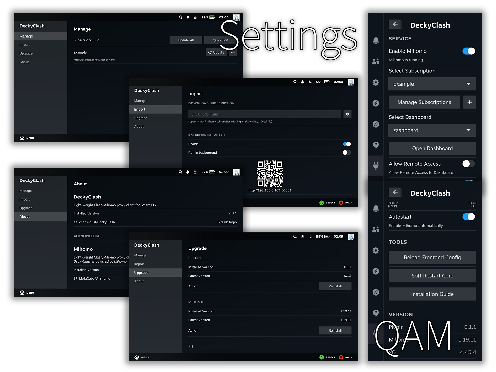

<div align="center">
   
   <div>
      
      
      
      
   </div>
   <p>
      <i>Light-weight Clash/Mihomo proxy client for Steam OS</i>
      <br />
      <i>为 Steam OS 设计的轻量的 Clash/Mihomo 代理客户端</i>
   </p>
   <p>
      <b>EN<b> | <a href="./README_CN.md">中文</a></b>
   <p>
</div>

## Features

- ✅ **Full featured:** [Mihomo](https://github.com/MetaCubeX/mihomo) core included
- 🚀 **Blazing fast:** optimized frontend and backend
- 📦 **Easy to use:** out of the box, with subscriptions importer and installation guide, etc.
- 🔒 **Focus on security:** random controller password, controllable outside access, etc.
- ⚙️ **Friendly to maintain:** written by Python and Node.js (React & Vite)
- 💡 **Keep update:** built-in upgrade tool to keep 3rd-party resources update
- 🌍 **I18n ready:** currently with Chinese (Simplified) and English support

## Screenshots



## License

This project is licensed by **BSD 3-Clause License** .

## Install

1. Install [Decky Loader](https://github.com/SteamDeckHomebrew/decky-loader) , skip if installed already

   ```sh
   curl -L https://github.com/SteamDeckHomebrew/decky-installer/releases/latest/download/install_release.sh | sh
   ```

2. Install DeckyClash

   ```sh
   curl -L https://github.com/chenx-dust/DeckyClash/raw/refs/heads/main/install.sh | bash
   ```

   The installation script will download the latest release from Github, as well as necessary third-party resources such as the latest Mihomo core, the latest yq processor, recommended Dashboards, and the Geo files required by the core.

   The script includes functions to download nightly versions and update third-party resources, which can be viewed through the `-h` parameter:

   ```sh
   curl -L https://github.com/chenx-dust/DeckyClash/raw/refs/heads/main/install.sh | bash -s -- -h
   ```

## Upgrade

Plugin will automatically check for updates every time you enter the Steam interface. If there is a new version, a toast will be shown.

Built-in upgrade:

1. Enter the Quick Access Menu and select **DeckyClash**
2. Find the **Version** column and click the **Manage Upgrades** button
3. The program will automatically check for updates, and the **Latest Version** row will display
4. If **Latest Version** and **Installed Version** are different, an upgrade button will be shown, click to start

Full upgrade (i.e., execute the installation step):

```sh
curl -L https://github.com/chenx-dust/DeckyClash/raw/refs/heads/main/install.sh | bash
```

Only upgrade third-party resources:

```sh
curl -L https://github.com/chenx-dust/DeckyClash/raw/refs/heads/main/install.sh | bash -s -- --without-plugin --yes
```

## Uninstall

**Note:** The script uninstalls DeckyClash, which will delete all files, including settings, subscriptions, downloaded Dashboards, etc. Please use with caution.

```sh
curl -L https://github.com/chenx-dust/DeckyClash/raw/refs/heads/main/install.sh | bash -s -- --clean-uninstall
```

## Development Guide

See [DEV_GUIDE.md](./docs/DEV_GUIDE.md) for details.

## Acknowledge

- [MetaCubeX/mihomo](https://github.com/MetaCubeX/mihomo): DeckyClash is powered by Mihomo.
- [mikefarah/yq](https://github.com/mikefarah/yq) DeckyClash uses yq as its YAML processor.
- [YukiCoco/ToMoon](https://github.com/YukiCoco/ToMoon): DeckyClash is inspired by To Moon.
