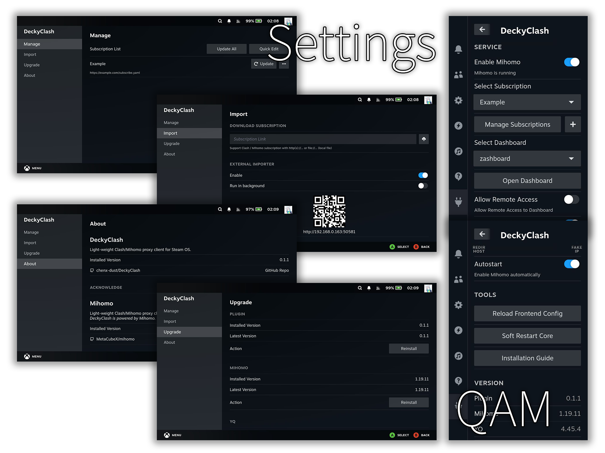

<div align="center">
   
   <div>
      
      
      
      
   </div>
   <p>
      <i>Light-weight Clash/Mihomo proxy client for Steam OS</i>
      <br>
      <i>为 Steam OS 设计的轻量的 Clash/Mihomo 代理客户端</i>
   </p>
   <p>
      <b>EN</b> | <b><a href="./README_CN.md">中文</a></b>
   <p>
</div>

> [!CAUTION]
> 如果您是中华人民共和国公民或者长期居住在中华人民共和国境内，请在使用前仔细阅读并理解 [免责声明](./README_CN.md#免责声明) 中的内容。下载、安装或使用本项目即表示您同意免责声明中的条款，并承担由此产生的全部责任。

## Features

- ✅ **Full featured:** [Mihomo](https://github.com/MetaCubeX/mihomo) core included
- 🚀 **Blazing fast:** optimized frontend and backend
- 📦 **Easy to use:** out of the box, with subscriptions importer and installation guide, etc.
- 🔒 **Focus on security:** random controller password, controllable outside access, etc.
- ⚙️ **Friendly to maintain:** written by Python and Node.js
- 💡 **Keep update:** built-in upgrade tool to keep 3rd-party resources update
- 🌍 **I18n ready:** currently with Chinese (Simplified) and English support

## Screenshots



## License

This project is licensed by **BSD 3-Clause License** .

## Install

### Prerequisite

Install [Decky Loader](https://github.com/SteamDeckHomebrew/decky-loader)

```sh
curl -L https://github.com/SteamDeckHomebrew/decky-installer/releases/latest/download/install_release.sh | sh
```

### Online Install Script (Recommended)

```sh
curl -L https://ba.sh/HMtV | bash
```

The installation script will download the latest release from Github, as well as necessary third-party resources such as the latest Mihomo core, recommended Dashboards, and the Geo files required by the core.

The script includes functions to download nightly versions and update third-party resources, which can be viewed through the `-h` parameter:

```sh
curl -L https://ba.sh/HMtV | bash -s -- -h
```

### Offline Installer

> [!NOTE]
> This offline installer includes all necessary third-party resources. However, it may not be up-to-date as the online installer.

1. Go to [Latest Release](https://github.com/chenx-dust/DeckyClash/releases/latest) and download `Installer-DeckyClash.sh`

2. Use any method to send the installer to your target device, e.g. USB, SCP, etc.

3. Grant executable permission to the installer

   ```sh
   chmod +x Installer-DeckyClash.sh
   ```

4. Run the installer and follow the instructions

   ```sh
   ./Installer-DeckyClash.sh
   ```

## Upgrade

Plugin will automatically check for updates every time you enter the Steam interface. If there is a new version, a toast will be shown.

### Built-in upgrade

1. Enter the Quick Access Menu and select **Decky Clash**
2. Find the **Version** column and click the **Manage Upgrades** button
3. The program will automatically check for updates, and the **Latest Version** row will display
4. If **Latest Version** and **Installed Version** are different, an upgrade button will be shown, click to start

### Full upgrade

(Same as the installation step)

### Upgrade Third-Party Resources

Execute the following command:

```sh
curl -L https://ba.sh/HMtV | bash -s -- --without-plugin --without-restart --yes
```

## Uninstall

> [!CAUTION]
> The script uninstalls Decky Clash, which will delete all files, including settings, subscriptions, downloaded Dashboards, etc. Please use with caution.

```sh
curl -L https://ba.sh/HMtV | bash -s -- --clean-uninstall
```

## Frequently Asked Questions

See [FAQ.md](./docs/FAQ.md#frequently-asked-questions) for details.

## Development Guide

See [DEV_GUIDE.md](./docs/DEV_GUIDE.md) for details.

## Acknowledge

- [MetaCubeX/mihomo](https://github.com/MetaCubeX/mihomo): Decky Clash is powered by Mihomo.
- [ruamel-yaml](https://sourceforge.net/projects/ruamel-yaml/): Decky Clash uses ruamel-yaml as its YAML processor.
- [YukiCoco/ToMoon](https://github.com/YukiCoco/ToMoon): Decky Clash is inspired by To Moon.
- [ba.sh](https://app.ba.sh/): Free URL shorten service for open source projects.
