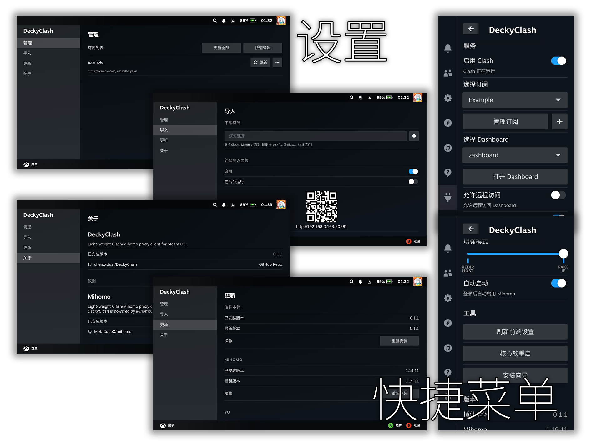

<div align="center">
  
  <div>
    
    
    
    
  </div>
  <p>
    <i>Light-weight Clash/Mihomo proxy client for Steam OS</i>
    <br>
    <i>为 Steam OS 设计的轻量的 Clash/Mihomo 代理客户端</i>
  </p>
  <p>
    <b>中文</b> | <b><a href="./README.md">EN</a></b>
  <p>
</div>

## 免责声明

> [!CAUTION]
> 如果您是中华人民共和国公民或者长期居住在中华人民共和国境内，请在使用前仔细阅读并理解以下内容。下载、安装或使用本项目即表示您同意以下条款，并承担由此产生的全部责任。

本软件仅限用于游戏加速等符合中华人民共和国法律法规的用途，不提供任何规避监管制度的功能。我们坚决反对用于网络犯罪等目的。用户在使用本软件时必须遵守中华人民共和国的相关法律法规，不得利用本软件从事任何违法犯罪活动。我们有权拒绝为任何涉及或可能涉及网络犯罪或规避监管制度的用途提供技术支持，不对因使用本软件而导致的任何法律责任、经济损失或其他后果承担任何责任。

## 功能

- ✅ **功能齐全：** 内置 [Mihomo](https://github.com/MetaCubeX/mihomo) 核心
- 🚀 **极速体验：** 前端与后端均经过优化
- 📦 **易于使用：** 开箱即用，有订阅外部导入、安装引导等实用工具
- 🔒 **注重安全：** 随机生成的控制器密码、外部访问可选等
- ⚙️ **便于维护：** 使用 Python 与 Node.js 编写
- 💡 **保持更新：** 自带第三方资源更新工具，时刻保持最新状态
- 🌍 **多种语言：** 当前支持简体中文和英文

## 截图



## 授权

本项目以 **BSD 3-Clause License** 授权。

## 安装

### 前置条件

> [!WARNING]
> 使用此方法安装 Decky Loader 需要在能流畅访问 Github 的网络条件下进行。如果不具备此条件，请利用搜索引擎寻找镜像或其它替代方案。

安装 [Decky Loader](https://github.com/SteamDeckHomebrew/decky-loader)

```sh
curl -L https://github.com/SteamDeckHomebrew/decky-installer/releases/latest/download/install_release.sh | sh
```

### 在线安装脚本

> [!WARNING]
> 使用在线安装脚本安装 Decky Clash 需要在能流畅访问 Github 的网络条件下进行。

```sh
curl -L https://ba.sh/HMtV | bash
```

安装脚本会从 Github 下载最新的发行版本，以及必要的第三方资源，如：最新的 Mihomo 核心、推荐使用的 Dashboards 以及核心需要的 Geo 文件等。

脚本包含下载每夜版本、更新第三方资源等功能，可以通过 `-h/--help` 参数查看用法：

```sh
curl -L https://ba.sh/HMtV | bash -s -- --help
```

### 离线安装包

> [!NOTE]
> 离线安装包包含所有第三方资源，但无法保证最新。更加适用于目标设备无法访问 Github 的情况。

1. 访问 [Latest Release](https://github.com/chenx-dust/DeckyClash/releases/latest) 页面，下载 `Installer-DeckyClash.sh` 文件。

2. 用任意方法将安装包发送至目标设备，如 USB 存储设备、SCP 等。

3. 授予安装包执行权限：

   ```sh
   chmod +x Installer-DeckyClash.sh
   ```

4. 运行安装包，遵循指示进行安装

   ```sh
   ./Installer-DeckyClash.sh
   ```

## 更新

每次进入 Steam 界面后，插件会自动检查更新。如有新版本会通过通知提醒。

### 插件内更新

> [!WARNING]
> 插件内更新 Decky Clash 需要在能流畅访问 Github 的网络条件下进行，可以通过合理使用 DeckyClash 功能来实现。

1. 进入快捷指令菜单，选择 **Decky Clash**
2. 找到 **版本** 栏目，点击 **管理更新** 按钮
3. 程序会自动检查更新，并在 **最新版本** 栏目中显示
4. 若 **最新版本** 和 **已安装版本** 不同时，操作按钮会提示更新，点击即可开始

### 完整更新

（与安装步骤相同）

### 更新第三方资源

执行以下下命令：

```sh
curl -L https://ba.sh/HMtV | bash -s -- --without-plugin --without-restart --yes
```

## 卸载

> [!CAUTION]
> 脚本卸载会清除 Decky Clash 的所有文件，包含设置、订阅、已下载的 Dashboard 等数据，请谨慎使用。

在终端执行：

```sh
curl -L https://ba.sh/HMtV | bash -s -- --clean-uninstall
```

## 开发指南

参见 [DEV_GUIDE.md](./docs/DEV_GUIDE.md)

## 致谢

- [MetaCubeX/mihomo](https://github.com/MetaCubeX/mihomo): Decky Clash 由 Mihomo 提供支持。
- [ruamel-yaml](https://sourceforge.net/projects/ruamel-yaml/) Decky Clash 使用 ruamel-yaml 作为 YAML 处理器。
- [YukiCoco/ToMoon](https://github.com/YukiCoco/ToMoon): Decky Clash 是受 To Moon 启发而开发的。
- [ba.sh](https://app.ba.sh/): 为开源项目提供免费的 URL 短链服务。
